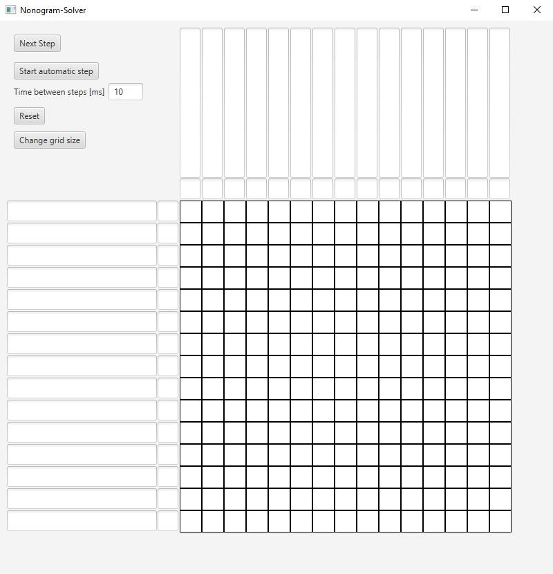

# Griddler
Solver for [Nonogram-Puzzles](https://en.wikipedia.org/wiki/Nonogram) built on the [JavaFX](https://openjfx.io/) framework for Java.

## Status
This project is currently under development and not ready to be released yet.

## Screenshots
Once you start the program, you will first see this:


## Build instructions
The following instructions are windows exclusive.
* To build the project yourself, first make sure you have Java 8 installed.
  * To check your version of java, run ```java -version```.  
    The first line should look similar to this:
    ```java version "1.8.0_181"```.
* Now you can first clone the repository using the command
  ```git clone https://github.com/MaximilianMitterrutzner/Nonogram-Solver.git```.
* Then navigate to the folder Nonogram-Solver/src with
  ```cd Nonogram-Solver\src```.
* Compile the Java program using
  ```javac com\mitmax\NonogramSolver.java```.
* Finally, run it with
```java com.mitmax.NonogramSolver```.
